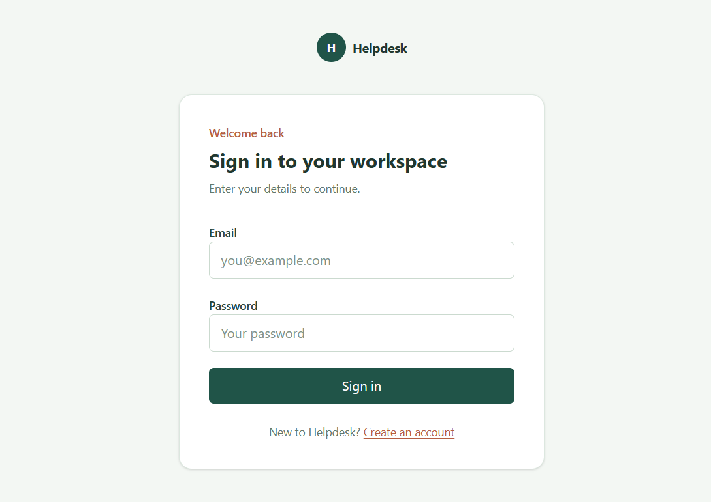
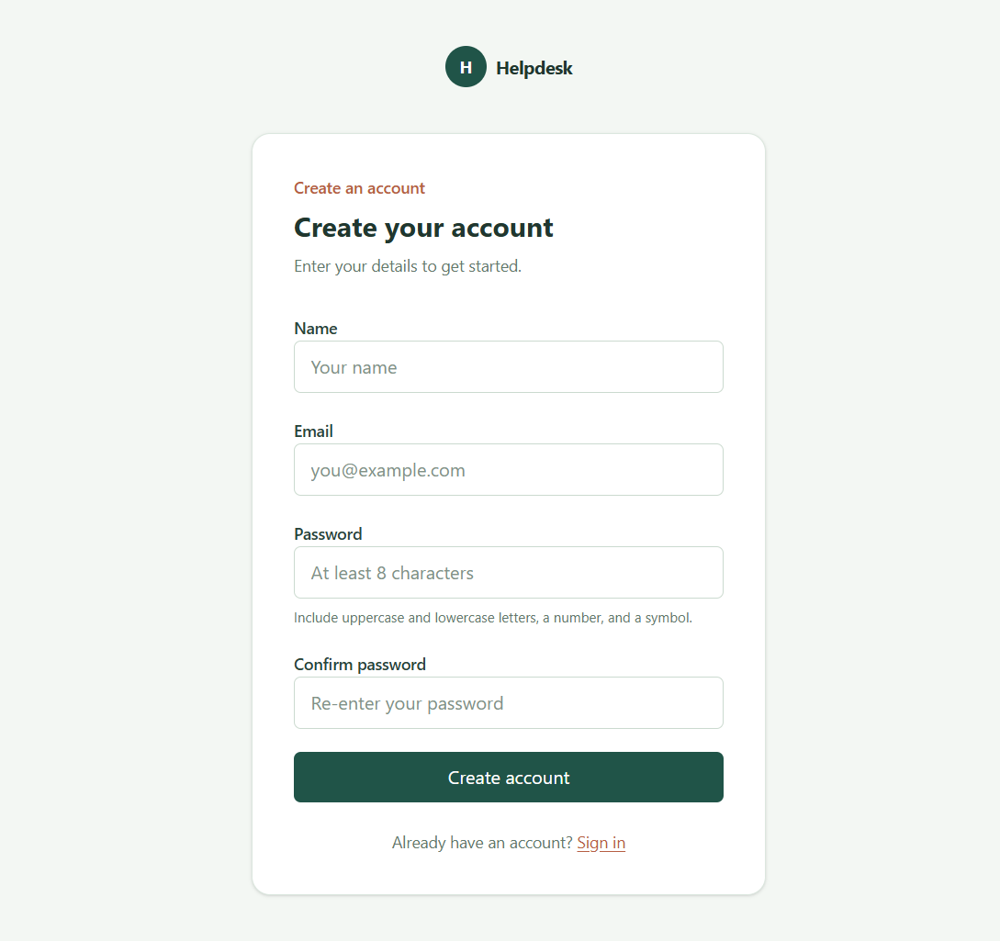
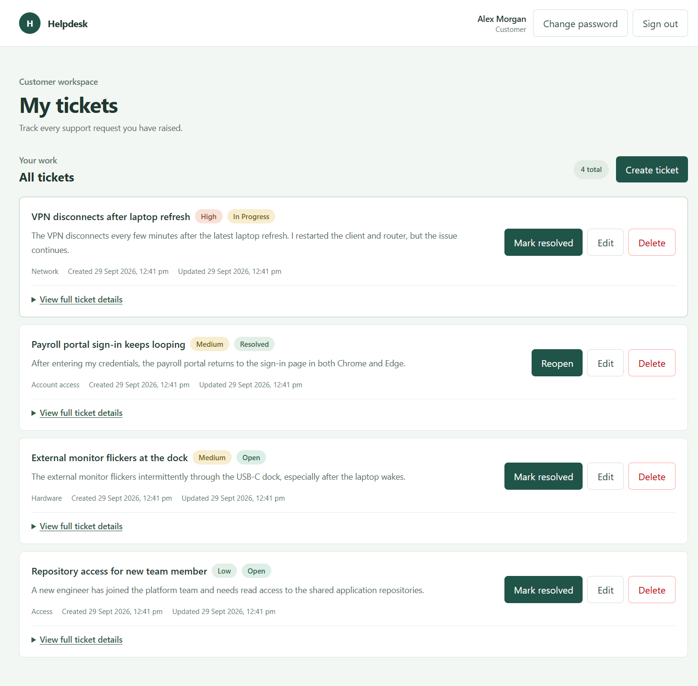
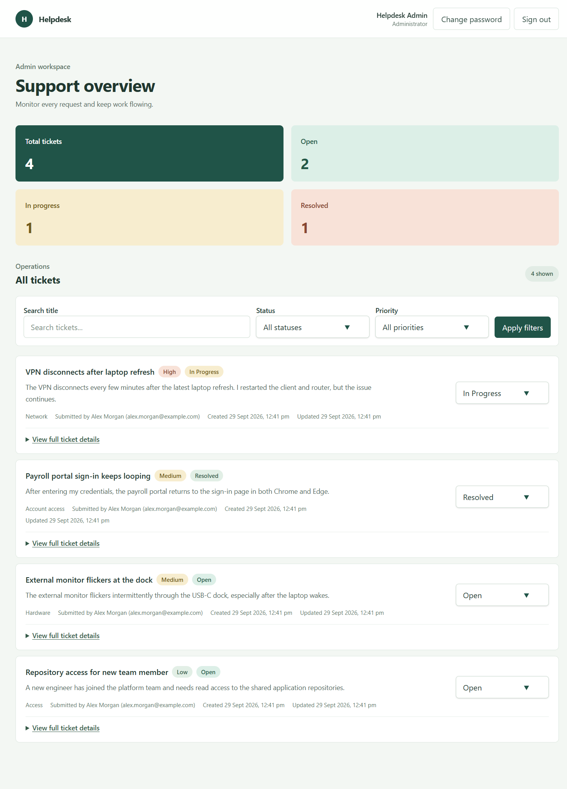

# Helpdesk

Helpdesk is a full-stack support ticket application with separate customer and administrator workflows.

Customers can create an account, sign in, create support tickets, update ticket details, set priorities, and keep track of their tickets. Administrators can view the shared ticket queue, search and filter tickets, update their status, and see basic ticket statistics.

## Tech stack

* React 19, TypeScript, Vite
* Python 3.12, FastAPI, SQLAlchemy
* PostgreSQL 16
* JWT authentication
* bcrypt password hashing
* Docker Compose

## Running the project with Docker

Docker Compose is the recommended way to run the application because it starts the frontend, API, and PostgreSQL database together.

Python is still required on the host because the setup script is used to generate the local `.env` file.

### Install Docker

If Docker is already installed, you can skip this section.

**Windows**

Install [Docker Desktop for Windows](https://docs.docker.com/desktop/setup/install/windows-install/) and use the WSL 2 backend. Make sure Docker Desktop is running in Linux-container mode.

**Linux**

Install [Docker Engine](https://docs.docker.com/engine/install/) and the [Docker Compose plugin](https://docs.docker.com/compose/install/linux/).

After installation, open a new terminal and check that Docker is available:

```sh
docker --version
docker compose version
```

### Start the application

Run these commands from the project root.

First, make sure Python is installed.

**Windows PowerShell:**

```powershell
py scripts/setup_env.py
```

**Linux:**

```sh
python3 scripts/setup_env.py
```

Then start the application:

```sh
docker compose up --build
```

The setup script creates the root `.env` file from `.env.example`.

It generates fresh random values for the application secrets and leaves an existing `.env` unchanged. The administrator password is printed once by the script, so save it somewhere safe before continuing.

Docker Compose checks that the required environment variables are available before starting the services.

Once everything is running:

* Frontend: http://localhost:5173
* API: http://localhost:8000
* API documentation: http://localhost:8000/docs

The initial administrator account is created from `ADMIN_EMAIL` and `ADMIN_PASSWORD` when the API starts with an empty database.

For the customer workflow, create a normal user account through the application.

### Stopping the application

To stop the containers:

```sh
docker compose down
```

The PostgreSQL volume is kept, so your database data remains available the next time you start the project.

To remove the database and all stored data:

```sh
docker compose down -v
```

Only use the `-v` option when you intentionally want to reset the database.

Changing values in `.env` does not recreate an administrator account that already exists in the database.

## Running without Docker

Docker is the easiest way to run the complete project, but the frontend and backend can also be run directly on the host.

You will need:

* [Python 3.12+](https://www.python.org/downloads/)
* [Node.js](https://nodejs.org/en/download)
* [npm](https://docs.npmjs.com/downloading-and-installing-node-js-and-npm)
* [PostgreSQL](https://www.postgresql.org/download/)

### 1. Create the PostgreSQL database

Create a PostgreSQL user and database:

```sql
CREATE USER helpdesk_user WITH PASSWORD 'your-password';
CREATE DATABASE helpdesk_db OWNER helpdesk_user;
```

### 2. Generate the environment file

From the project root, run:

**Windows:**

```powershell
py scripts/setup_env.py
```

**Linux:**

```sh
python3 scripts/setup_env.py
```

Open the generated `.env` file and set:

```env
POSTGRES_PASSWORD=your-password
POSTGRES_HOST=localhost
```

Keep the administrator credentials printed by the setup script. They are used to sign in to the admin side of the application.

### 3. Start the backend

Open a terminal in the `backend` directory.

**Linux:**

```sh
python3 -m venv .venv
.venv/bin/python -m pip install -r requirements.txt
.venv/bin/python -m uvicorn app.main:app --reload --env-file ../.env
```

**Windows PowerShell:**

```powershell
py -m venv .venv
.venv\Scripts\python.exe -m pip install -r requirements.txt
.venv\Scripts\python.exe -m uvicorn app.main:app --reload --env-file ..\.env
```

The virtual environment's Python executable is used directly, so activating the environment is not required.

### 4. Start the frontend

Open another terminal:

```sh
cd frontend
npm install
npm run dev
```

The frontend will be available at:

```text
http://localhost:5173
```

## Environment variables

The setup script creates the root `.env` file from `.env.example`.

Docker Compose reads this file automatically. When running the API directly, Uvicorn loads the same file using `--env-file`.

| Variable                      | Description                                                                 |
| ----------------------------- | --------------------------------------------------------------------------- |
| `POSTGRES_DB`                 | PostgreSQL database name                                                    |
| `POSTGRES_USER`               | PostgreSQL username                                                         |
| `POSTGRES_PASSWORD`           | PostgreSQL password                                                         |
| `POSTGRES_HOST`               | Database host (`db` with Docker Compose, `localhost` for local development) |
| `POSTGRES_PORT`               | PostgreSQL port, normally `5432`                                            |
| `JWT_SECRET`                  | Secret used to sign JWT access tokens                                       |
| `ACCESS_TOKEN_EXPIRE_MINUTES` | Access-token lifetime in minutes                                            |
| `FRONTEND_ORIGIN`             | Frontend origin allowed by the API CORS configuration                       |
| `ADMIN_EMAIL`                 | Email address for the initial administrator                                 |
| `ADMIN_PASSWORD`              | Password for the initial administrator                                      |

## API

The API base URL is:

```text
http://localhost:8000/api
```

Interactive API documentation is available at:

```text
http://localhost:8000/docs
```

The OpenAPI schema is available at:

```text
http://localhost:8000/openapi.json
```

Protected endpoints use a bearer token:

```http
Authorization: Bearer <access_token>
```

Registration and login both return an access token and the authenticated user's profile. The token can then be used for subsequent protected requests.

There is no separate logout endpoint. Signing out on the frontend removes the stored browser token.

### Authentication and account

| Method  | Route                | Access    | Description                                                      |
| ------- | -------------------- | --------- | ---------------------------------------------------------------- |
| `POST`  | `/auth/register`     | Public    | Creates a customer account and returns a token and user profile. |
| `POST`  | `/auth/login`        | Public    | Authenticates a user and returns a token and user profile.       |
| `GET`   | `/users/me`          | Signed in | Returns the current user's account details.                      |
| `PATCH` | `/users/me/password` | Signed in | Changes the current user's password.                             |

Registration accepts:

```json
{
  "name": "John Doe",
  "email": "john@example.com",
  "password": "Example@123"
}
```

Passwords must be 8–72 characters and contain:

* An uppercase letter
* A lowercase letter
* A number
* A symbol

Duplicate email addresses return `409`.

Invalid login credentials return `401`.

Changing the password requires the current password. Reusing the current password is rejected.

### Customer tickets

Customers can only access tickets that belong to their account.

| Method   | Route                         | Description                                                                 |
| -------- | ----------------------------- | --------------------------------------------------------------------------- |
| `GET`    | `/tickets`                    | Lists the signed-in user's tickets, newest updates first.                   |
| `POST`   | `/tickets`                    | Creates a new ticket.                                                       |
| `GET`    | `/tickets/{ticket_id}`        | Returns a ticket owned by the current user. Admins can also access tickets. |
| `PATCH`  | `/tickets/{ticket_id}`        | Updates an accessible ticket.                                               |
| `PATCH`  | `/tickets/{ticket_id}/status` | Changes the status of the customer's own ticket.                            |
| `DELETE` | `/tickets/{ticket_id}`        | Deletes an owned ticket.                                                    |

A new ticket accepts:

```json
{
  "title": "Unable to access my account",
  "description": "I am unable to sign in after resetting my password.",
  "category": "Account",
  "priority": "Medium"
}
```

Ticket fields have the following limits:

| Field         | Rules                      |
| ------------- | -------------------------- |
| `title`       | 3–140 characters           |
| `description` | 10–5000 characters         |
| `category`    | 2–60 characters            |
| `priority`    | `Low`, `Medium`, or `High` |

Priority defaults to `Medium`.

New tickets start with the `Open` status.

Customers can change their own ticket between:

* `Open`
* `Resolved`

Other status changes are restricted to administrators.

### Administration

Admin endpoints require an authenticated account with the `admin` role.

The initial administrator is created using `ADMIN_EMAIL` and `ADMIN_PASSWORD`.

| Method  | Route                               | Description                       |
| ------- | ----------------------------------- | --------------------------------- |
| `GET`   | `/admin/tickets`                    | Lists all tickets in the system.  |
| `PATCH` | `/admin/tickets/{ticket_id}/status` | Changes the status of any ticket. |
| `GET`   | `/admin/stats`                      | Returns ticket counts by status.  |

The admin ticket list supports these optional filters:

| Parameter  | Values / behavior                   |
| ---------- | ----------------------------------- |
| `status`   | `Open`, `In Progress`, `Resolved`   |
| `priority` | `Low`, `Medium`, `High`             |
| `q`        | Searches ticket titles by substring |

Admin ticket responses also include the ticket owner's details.

The statistics endpoint returns:

```json
{
  "total": 12,
  "open": 5,
  "in_progress": 3,
  "resolved": 4
}
```

### Common responses

| Status | Meaning                                       |
| ------ | --------------------------------------------- |
| `401`  | Missing, invalid, or expired authentication   |
| `403`  | Authenticated user does not have permission   |
| `404`  | Requested ticket or resource was not found    |
| `409`  | Conflict, such as an already registered email |
| `422`  | Request validation failed                     |

The health endpoint is public:

```text
GET /api/health
```

Response:

```json
{
  "status": "ok"
}
```

## Project structure

```text
frontend/
└── React application

backend/
└── app/
    ├── FastAPI routes
    ├── database models
    ├── request/response schemas
    └── authentication helpers

docker-compose.yml
.env.example
```

For backend changes, the main API routes and request/response models are currently in:

```text
backend/app/main.py
backend/app/schemas.py
```

Backend schema tests are located in:

```text
backend/tests/
```

The frontend source is under:

```text
frontend/src/
```

API calls are handled through:

```text
frontend/src/lib/api.ts
```

## Screenshots

The screenshots below show the authentication screens and demo ticket workflows.

### Login



### Registration



### Customer workspace



### Admin dashboard


